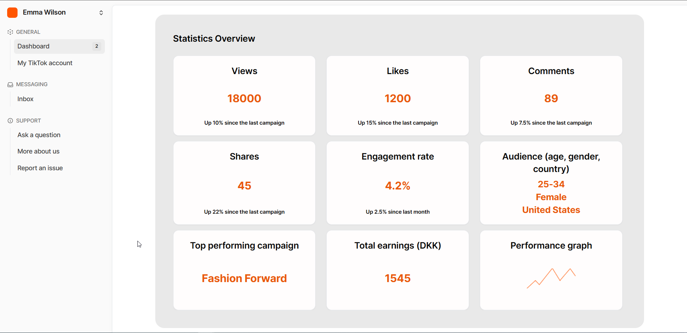
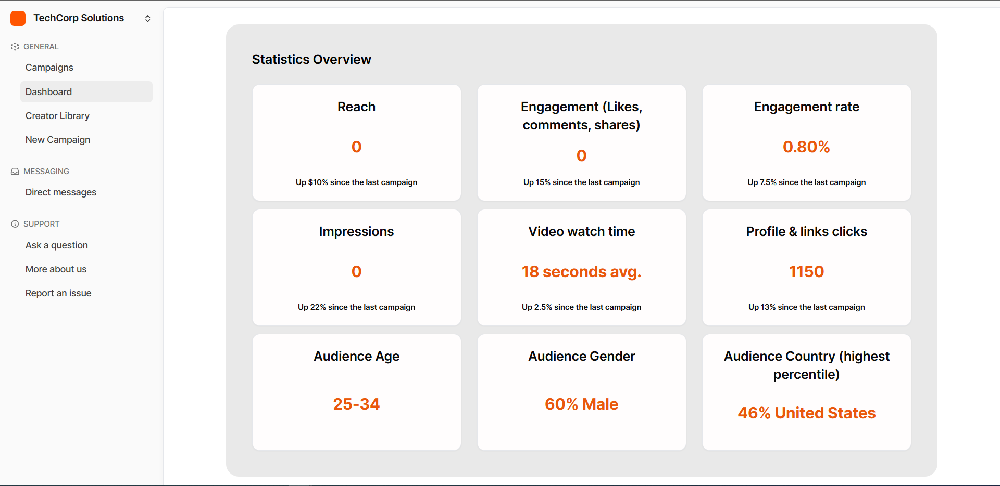

# HYF Final Project: Collaboration with Adwiseli

## 🎯 Influencer & Brand Analytics Dashboard

A modern web platform that provides **real-time analytics** for **influencers** and **brands** to help monitor performance, engagement, and audience insights.

[Dashboard Influencer Figma](https://www.figma.com/design/XpadL1FGUrjZOXCLn9X74W/Adwiseli_dashboard_influencer?node-id=0-1&t=wUwZEFVIBeSAyRRX-0)  
[Dashboard Brand Figma](https://www.figma.com/design/98LkP6Aj1MjKmSEdWGAPTS/Adwiseli_dashboard?node-id=0-1&p=f&m=draw)

---

## 📌 Overview

This project includes two custom dashboards:

-   🧑‍💼 **Influencer Dashboard** – Tracks views, likes, shares, engagement rate, audience breakdown, and earnings.
-   🏢 **Brand Dashboard** – Shows impressions, video performance, engagement, profile clicks, and audience data.

### 🎯 Purpose

To provide marketing teams and influencers with reliable real-time insights into campaign performance and audience metrics.

### 📚 Scope

This application supports brands and influencers in tracking content performance across multiple dimensions.

### ✅ Objectives

-   Build two custom dashboards
-   Provide backend API integration
-   Use PostgreSQL and Prisma for structured data handling

---

## ✨ Features

-   📊 Real-time performance metrics (views, likes, comments, shares, etc.)
-   💰 Earnings overview (DKK)
-   🌍 Demographic breakdown (age, gender, country)
-   📈 Engagement rate calculations
-   🔝 Top campaign display
-   📆 Performance graph (time-series data)
-   🧠 Backend data modeling using PostgreSQL + Prisma
-   💻 API-based dashboard rendering

---

## 🧪 Demo

👉 **Live Preview:**  
[🔗 Influencer Dashboard Design](link)  
[🔗 Brand Dashboard Design](link)

🖼️ **Screenshots:**

### Influencer Dashboard



### Brand Dashboard



---

## 🛠️ Tech Stack

| Technology            | Purpose                                |
| --------------------- | -------------------------------------- |
| **Next.js**           | Frontend framework (React-based)       |
| **Node.js + Express** | Backend / API development              |
| **PostgreSQL**        | Relational database                    |
| **Prisma**            | ORM for database modeling              |
| **TypeScript**        | Type-safe backend & frontend logic     |
| **Figma**             | UI/UX design and dashboard prototyping |

---

## ⚙️ Setup Instructions

1. **Clone the repository:**

```bash
git clone https://github.com/your-org/hyf-adwiseli.git
cd hyf-adwiseli
```

2. **Install dependencies for each part:**

```bash
# Backend
cd api
npm install

# Brand frontend
cd ../brand
npm install

# Influencer frontend
cd ../influencer
npm install
```

3. **Configure environment variables** (`.env` in `api` directory):

```
DATABASE_URL=postgresql://<user>:<password>@localhost:5432/adwiseli
```

4. **Run PostgreSQL** locally or connect to an external instance.

---

## 🔧 Configuration

-   After `.env` setup, apply migrations:

```bash
cd api
npx prisma migrate dev --name init
```

-   (Optional) Seed database with mock data:

```bash
npm run seed
```

---

## ▶️ Usage

### Start Backend:

```bash
cd api
npm run dev
```

### Start Frontend (Brand or Influencer):

```bash
# Brand dashboard
cd brand
npm run dev

# Influencer dashboard
cd influencer
npm run dev
```

Frontend runs on `http://localhost:3000`  
API runs on `http://localhost:8080` (or as configured)

---

## 🔌 API Reference

| Method | Endpoint                        | Description                     |
| ------ | ------------------------------- | ------------------------------- |
| GET    | `/api/brand/:brandId/dashboard` | Fetch brand analytics data      |
| GET    | `/api/influencer/dashboard`     | Fetch influencer analytics data |

All responses are returned as JSON for frontend integration.

---

## 🧱 Project Architecture

```
[ Influencer UI ]      [ Brand UI ]
       ↓                    ↓
     React + Next.js Frontend
               ↓
       API (Node.js + Express)
               ↓
    Prisma ORM → PostgreSQL DB
```

---

## 📁 Project Structure

```
hyf-adwiseli/
├── api/
│   └── src/
│       └── routes/
│           ├── brand/
│           │   ├── [brandId]/
│           │   │   └── dashboard/
│           │   │       └── index.ts
│           │   └── index.ts
│           └── influencer/
│               └── dashboard/
│                   └── index.ts
├── brand/
│   └── src/
│       ├── components/
│       │   └── organisms/
│       │       └── Dashboard/
│       │           ├── DashboardCard.tsx
│       │           └── DashboardContainer.tsx
│       ├── hooks/
│       │   └── useDashboardData.ts
│       └── queries/
│           └── brand/
│               └── fetchBrandData.ts
└── influencer/
    └── src/
        ├── components/
        │   └── organisms/
        │       └── Dashboard/
        │           ├── DashboardCard.tsx
        │           └── DashboardContainer.tsx
        ├── hooks/
        │   └── useDashboardData.ts
        └── queries/
            └── influencer/
                └── fetchInfluencerData.ts
```

---

## 🧑‍💻👩‍💻 Team & Contributions

### 🙋‍♀️ Ruslana Onyshchuk

-   👩‍🏫 **Scrum Master** – Facilitated regular team stand-ups (2–3 times per week), sprint planning, retrospectives, and maintained team workflow and communication.
-   👩‍💻 **Backend Developer**
    -   Designed and implemented SQL database schema:
        `BrandProfileClick`, `Earnings`, `CampaignVideo`, `PerformanceMetric`
    -   Created PostgreSQL mock data scripts using `INSERT` statements and time-based values (`NOW() - INTERVAL`)
    -   Built API route to fetch brand and campaign performance data
    -   Implemented logic to calculate average `performanceMetricsScore` and derive `engagementRate`
    -   Ensured backend data flow consistency with frontend dashboard components

### 🙋‍♀️ Güzide Güzelbey Esengün

-   👩‍🏫 **Design Leader** - Ensured consistent implementation of the Figma design system across both applications and conducted design reviews to maintain visual accuracy, UI alignment, and quality standards.
-   👩‍💻 **Frontend Developer**
    -   Developed useDashboardData hooks for both brand and influencer apps, converting API responses into structured, dynamic card data for dashboards.
    -   Implemented logic to extract audience insights, campaign stats, and engagement metrics.
    -   Ensured data was returned in a consistent format to support reusable dashboard components across both apps.
    -   Designed and established the front-end folder structure to support clean integration into the existing project architecture.

### 🙋‍♀️ Jianxin Zhao

-   👩‍🏫 **Communication Manager** - Acted as primary contact point between team and client, coordinating feedback, requirements, and timeline alignment
-   👩‍💻 **Frontend Developer**
    -   Developed backend API route to fetch influencer performance data (views, likes, comments, shares, followers, engagement rate)
    -   Structured JSON response to support frontend dashboard visualization
    -   Ensured accurate data transformation and validation for consistent UI presentation

### 🙋‍♂️ Andrii Khandohii

-   👨‍🏫 **Deployment Specialist** - Ensured stable deployment processes across the project by managing build integrity and deployment environments. Assisted in resolving integration-related issues and supported the team in maintaining a smooth development-to-deployment workflow without interruptions.
-   👨‍💻 **Frontend Developer**
    -   Developed the DashboardCard component — a responsive statistics card displaying key metrics in a unified format. Focused on its design by fine-tuning paddings, text alignment, and visual hierarchy to match the Figma design system.
    -   Updated the routing logic to correctly render the Dashboard page with dynamic data loading and ensured seamless integration into the existing navigation structure.
    -   Also implemented a custom button component for dashboard actions or navigation, following the project's UI/UX standards.
    -   Worked closely with useDashboardData and DashboardContainer components to ensure consistent data flow and clean integration of logic and visual components across the frontend.

### 🙋‍♀️ Seyedeh Najmeh Ghasemi

-   👩‍🏫 **Dependency Manager** - Managed project dependencies and ensured consistent imports and integrations across the app.
-   👩‍💻 **Frontend Developer**
    -   Developed the `DashboardContainer` component
    -   Imported shared logic and UI components such as:
        `useUser` custom hook,
        `useDashboardData` custom hook,
        `Loading` component for loading states,
        `DashboardCard` for rendering individual statistics cards
    -   Implemented conditional UI logic for loading and error states
    -   Structured layout with responsive design (using Tailwind CSS grid and flex utilities)
    -   Integrated fetched dashboard data into dynamic grid of cards\*\*

### 🙋‍♀️ Seyedeh Parisa Mousaviamiri

-   👩‍🏫 **Git Specialist** - Ensured seamless version control across teams by designing and maintaining Git workflows, including code reviews, and merge pipelines. Collaborated closely with developers to manage release cycles and resolve conflicts effectively.
-   👩‍💻 **Technical Contribution**
    -   Integrated user and dashboard data hooks
    -   Managed loading and error states with custom UI components
    -   Built a responsive dashboard layout displaying statistics with fallback handling for network issues and loading states.
    -   Maintained clean Git history through feature branches and pull requests, ensuring well-documented commits and smooth deployment integration.

### 🙋‍♂️ Hossein Saadatpour

-   👨‍🏫 **Testing Lead (QA)** - Checked different parts of the project to find bugs or UI issues, helped organize basic testing before final delivery
-   👨‍💻 **Frontend Developer**
    -   Built a dashboard page for both influencers and brands
    -   Used a reusable layout component that had already been created earlier in the project
    -   Added UI elements like Card, Container, and a Dashboard Button
    -   Worked with other team members to keep the design and user experience consistent

### 🙋‍♂️ Ayman B.

-   👨‍🏫 **Deployment Specialist**
-   👨‍💻 **Frontend Developer**
    -   Implemented the `fetchBrandData` function to retrieve and prepare all necessary data for the brand performance dashboard.
    -   Structured the data using TypeScript interfaces (`BrandDashboardData` and `BrandCampaign`) to ensure clarity and type safety.
    -   The function returns:
        -   Brand details (ID, name, followers, ROI)
        -   A list of campaigns with creator count, engagement rate, and audience insights
        -   Audience demographics by gender and country
        -   Key engagement metrics (views, likes, comments, shares)
    -   Default values are applied to prevent any crashes due to missing backend data, ensuring a stable and reliable frontend experience.
